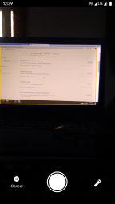
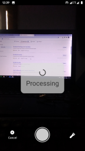
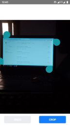

# react-native-document-scanner-example
Document scanner example using React Native

<b>Instructions to run the application</b>
  
* Download the code.
* Add the folder into your project.
* Install the required packages.
* Add the navigator in index.js to your main navigator. 
* Run the code.

<bFeatures</b>
  
* Detect rectangles in camera view.
* Perspective crop.
* Base64 image.

<b>Screenshots</b>
  

